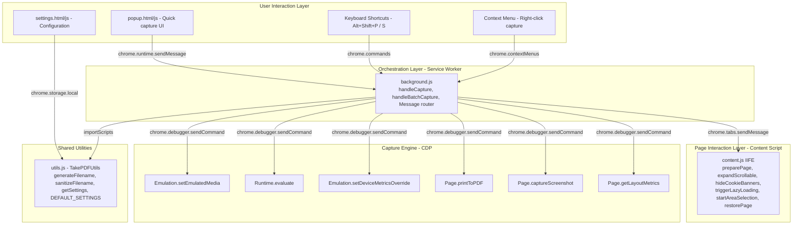

# takePDF — Code Documentation

> A developer's guide to understanding, navigating, and contributing to the takePDF Chrome extension codebase.

---

## Table of Contents

1. [Prerequisites & What You Need to Learn](#1-prerequisites--what-you-need-to-learn)
   - [Skill Matrix](#skill-matrix)
   - [Learning Roadmap](#learning-roadmap)
   - [Curated Resources by Topic](#curated-resources-by-topic)
   - [Mini-Projects to Build Skills](#mini-projects-to-build-skills)
2. [Project Overview](#2-project-overview)
3. [Architecture Diagram](#3-architecture-diagram)
4. [File Map & Where to Start](#4-file-map--where-to-start)
5. [Deep Dive: Each File Explained](#5-deep-dive-each-file-explained)
6. [Data Flow: How a Capture Works](#6-data-flow-how-a-capture-works)
7. [Chrome DevTools Protocol (CDP)](#7-chrome-devtools-protocol-cdp)
8. [Message Passing Architecture](#8-message-passing-architecture)
9. [Testing Infrastructure](#9-testing-infrastructure)
10. [Key Design Decisions & Trade-offs](#10-key-design-decisions--trade-offs)
11. [Common Pitfalls & Gotchas](#11-common-pitfalls--gotchas)
12. [How to Add a New Feature](#12-how-to-add-a-new-feature)

---

## 1. Prerequisites & What You Need to Learn

### Skill Matrix

Skills are organized into three tiers. You **must** be comfortable with Tier 1 before the codebase will make sense. Tier 2 is needed for meaningful contributions. Tier 3 is helpful context.

#### Tier 1 — Must-Know (Required to read the code)
| Topic | Why You Need It | Where It's Used |
|-------|-----------------|-----------------|
| **JavaScript (ES2020+)** | The entire codebase is vanilla JS. Async/await, Promises, destructuring, template literals, arrow functions, `Set`, spread operators. | Every file |
| **Chrome Extension Manifest V3** | The extension architecture — service workers, content scripts, popup pages, permissions, message passing. | `manifest.json`, all `.js` files |
| **DOM APIs** | `getComputedStyle`, `querySelectorAll`, `scrollHeight`, `clientHeight`, element style manipulation, event listeners, `MutationObserver`-style thinking. | `content.js` (380 lines of DOM work) |

#### Tier 2 — Should-Know (Required to contribute)
| Topic | Why You Need It | Where It's Used |
|-------|-----------------|-----------------|
| **Chrome DevTools Protocol (CDP)** | The entire capture engine. Controls Chrome's renderer to print PDFs and take screenshots. | `background.js` lines 184-298 |
| **Service Worker Lifecycle** | Background script can be killed anytime. No DOM, no `window`, no `URL.createObjectURL`. | `background.js` (keep-alive, `importScripts`) |
| **CSS Layout Model** | `position: fixed/sticky/relative/absolute`, `overflow`, viewport vs content dimensions, `@media print` vs `@media screen`. | `content.js` (fixed element handling), `background.js` (viewport override) |
| **Chrome Extension APIs** | `chrome.tabs`, `chrome.debugger`, `chrome.downloads`, `chrome.storage`, `chrome.scripting`, `chrome.runtime` messaging. | `background.js`, `popup.js`, `settings.js` |

#### Tier 3 — Nice-to-Know (Helpful context)
| Topic | Why | Where It Helps |
|-------|-----|----------------|
| **Jest Testing Framework** | Tests are written in Jest with jsdom environment and custom Chrome API mocks | `tests/` directory |
| **PDF Internals** | Why paper dimensions use inches, 96 DPI conversion, tagged PDFs for accessibility | `background.js` `printToPDF` params |
| **Base64 Encoding** | CDP returns capture data as base64 (~33% larger than binary). Size limits matter. | `background.js` clipboard/download logic |
| **CSS Selectors** | Complex selector strings for cookie banner detection, scrollable container identification | `content.js` lines 111, 151, 173-182 |

---

### Learning Roadmap

Follow this path from zero to fully understanding the codebase. Each phase builds on the previous one.

```
Phase 1: JavaScript Foundations (1-2 weeks)
  │
  ├── Core JS: variables, functions, objects, arrays, loops
  ├── ES6+: arrow functions, destructuring, template literals, spread/rest
  ├── Async JS: callbacks → Promises → async/await → Promise.all/race
  └── DOM: querySelector, addEventListener, createElement, style manipulation
  │
  ▼
Phase 2: Browser Internals (1 week)
  │
  ├── How browsers render pages (DOM → CSSOM → Layout → Paint)
  ├── CSS positioning: static, relative, absolute, fixed, sticky
  ├── Overflow & scrolling: scrollHeight vs clientHeight vs offsetHeight
  ├── Viewport: window.innerHeight, devicePixelRatio, CSS pixels vs device pixels
  └── @media queries: screen vs print
  │
  ▼
Phase 3: Chrome Extensions (1-2 weeks)
  │
  ├── Manifest V3 structure and lifecycle
  ├── Service workers (not the web kind — the extension kind)
  ├── Content scripts: injection, isolation, DOM access
  ├── Message passing: runtime.sendMessage, tabs.sendMessage, ports
  ├── Storage API: chrome.storage.local
  ├── Permissions model: required vs optional vs host
  └── Build a simple extension (see Mini-Projects below)
  │
  ▼
Phase 4: Chrome DevTools Protocol (3-5 days)
  │
  ├── What CDP is (the protocol behind Chrome DevTools)
  ├── Domains: Page, Runtime, Emulation, DOM, Network
  ├── chrome.debugger API (attach, sendCommand, detach)
  ├── Page.printToPDF and Page.captureScreenshot
  └── Emulation domain: device metrics, media override
  │
  ▼
Phase 5: This Codebase (1-2 days)
  │
  ├── Read files in recommended order (Section 4)
  ├── Trace a full PDF capture flow end-to-end
  ├── Run the tests, read the test mocks
  └── Make a small change (see Mini-Projects below)
```

---

### Curated Resources by Topic

#### JavaScript (ES2020+)

**Start here if**: You're new to JS or need a refresher on modern syntax.

| Resource | Type | Cost | Time | What You'll Learn |
|----------|------|------|------|-------------------|
| [javascript.info](https://javascript.info/) | Tutorial | Free | 20-40 hrs | **The best single JS resource.** Covers everything from basics to advanced. Start with Part 1 (The JavaScript Language). |
| [MDN JavaScript Guide](https://developer.mozilla.org/en-US/docs/Web/JavaScript/Guide) | Reference | Free | Ongoing | Official reference. Use alongside javascript.info for lookups. |
| [Eloquent JavaScript](https://eloquentjavascript.net/) | Book | Free | 30 hrs | Excellent book. Chapters 1-11 cover what you need. Free online. |
| [JavaScript30](https://javascript30.com/) | Video course | Free | 30 hrs | 30 small projects in vanilla JS. Great for DOM manipulation practice. |
| [You Don't Know JS](https://github.com/getify/You-Dont-Know-JS) | Book series | Free | 40 hrs | Deep understanding of JS internals. Read "Scope & Closures" and "Async & Performance". |

**Key chapters/topics to focus on for this codebase:**
- Promises & async/await — used in every file
- `Array.from()`, `.map()`, `.filter()`, `.forEach()` — used in `content.js`
- Template literals — used for CSS injection and filename generation
- Destructuring & spread — used for settings merging
- `Set` — used for concurrency lock in `background.js`
- `try/catch/finally` — error handling pattern in `handleCapture`
- IIFEs (Immediately Invoked Function Expressions) — `content.js` wrapping pattern

---

#### DOM & Browser APIs

**Start here if**: You can write JS but haven't done much DOM manipulation.

| Resource | Type | Cost | Time | What You'll Learn |
|----------|------|------|------|-------------------|
| [MDN DOM Manipulation](https://developer.mozilla.org/en-US/docs/Learn/JavaScript/Client-side_web_APIs/Manipulating_documents) | Tutorial | Free | 3 hrs | createElement, querySelector, style manipulation |
| [javascript.info — Document](https://javascript.info/document) | Tutorial | Free | 5 hrs | DOM tree, navigation, properties, styles. **Read this chapter fully.** |
| [javascript.info — Events](https://javascript.info/events) | Tutorial | Free | 4 hrs | addEventListener, event delegation, mouse events (used in area selection) |
| [What Forces Layout/Reflow](https://gist.github.com/paulirish/5d52fb081b3570c81e3a) | Reference | Free | 15 min | Which DOM properties trigger layout recalculation. Critical for understanding why `getComputedStyle` is expensive. |
| [Scroll APIs Visual Guide](https://developer.mozilla.org/en-US/docs/Web/API/Element/scrollHeight) | Reference | Free | 30 min | `scrollHeight` vs `clientHeight` vs `offsetHeight` — used in lazy loading and container detection |

**Key APIs used in this codebase:**
```javascript
// Used in content.js — you should understand all of these
document.querySelectorAll(selector)    // Find elements
element.getBoundingClientRect()         // Element position & size
window.getComputedStyle(element)        // Actual rendered CSS values
element.style.setProperty(prop, val)    // Set inline styles
element.scrollHeight / clientHeight     // Scroll overflow detection
window.scrollTo(x, y)                  // Programmatic scrolling
window.innerHeight                      // Viewport height
document.createElement('style')        // Inject CSS
document.fonts.ready                   // Wait for web fonts
img.addEventListener('load', fn)        // Image load detection
```

---

#### Chrome Extensions (Manifest V3)

**Start here if**: You've never built a Chrome extension.

| Resource | Type | Cost | Time | What You'll Learn |
|----------|------|------|------|-------------------|
| [Chrome Extension Docs — Getting Started](https://developer.chrome.com/docs/extensions/get-started) | Official Tutorial | Free | 2 hrs | **Do this first.** Build your first extension step-by-step. |
| [Chrome Extension Docs — Architecture Overview](https://developer.chrome.com/docs/extensions/develop/concepts/service-workers) | Official Docs | Free | 1 hr | Service worker lifecycle, content script isolation, message passing |
| [Chrome Extension in 10 Minutes (Fireship)](https://www.youtube.com/watch?v=0n809nd4Zu4) | Video | Free | 10 min | Quick conceptual overview of the MV3 model |
| [Build a Chrome Extension – freeCodeCamp](https://www.youtube.com/watch?v=0n809nd4Zu4) | Video | Free | 1 hr | Hands-on walkthrough building a real extension |
| [Chrome Extensions Samples](https://github.com/nicedoc/browser-extension-template) | Examples | Free | Varies | Official sample extensions for every API |
| [Chrome Extension API Reference](https://developer.chrome.com/docs/extensions/reference/api) | Reference | Free | Ongoing | API docs for `chrome.tabs`, `chrome.storage`, `chrome.scripting`, etc. |

**Key concepts to understand:**
```
Manifest V3 Architecture
├── manifest.json           ← Declares everything
├── Service Worker          ← background.js (no DOM, can die)
│   ├── chrome.runtime.onMessage.addListener  ← Receives messages
│   ├── chrome.tabs.sendMessage               ← Sends to content
│   ├── chrome.debugger                       ← CDP access
│   └── chrome.downloads                      ← File saving
├── Content Script          ← content.js (has DOM, runs in page)
│   └── chrome.runtime.onMessage.addListener  ← Receives from background
├── Popup Page              ← popup.html/js (short-lived UI)
│   └── chrome.runtime.sendMessage            ← Sends to background
├── Options Page            ← settings.html/js
│   └── chrome.storage.local                  ← Persistent storage
└── Permissions             ← What the extension can do
    ├── activeTab, tabs, scripting, debugger, downloads
    └── host_permissions: http://*/* , https://*/*
```

**Critical concept: Message passing**
```
popup.js ──sendMessage──► background.js ──tabs.sendMessage──► content.js
         ◄──onMessage───                ◄──sendResponse──────
```
Every message channel is asynchronous. `return true` in a listener keeps the channel open for async responses.

---

#### Chrome DevTools Protocol (CDP)

**Start here if**: You understand extensions but haven't used `chrome.debugger`.

| Resource | Type | Cost | Time | What You'll Learn |
|----------|------|------|------|-------------------|
| [CDP Official Docs](https://chromedevtools.github.io/devtools-protocol/) | Reference | Free | Ongoing | Complete protocol reference. Bookmark this. |
| [CDP — Page Domain](https://chromedevtools.github.io/devtools-protocol/tot/Page/) | Reference | Free | 30 min | `printToPDF`, `captureScreenshot`, `getLayoutMetrics` |
| [CDP — Emulation Domain](https://chromedevtools.github.io/devtools-protocol/tot/Emulation/) | Reference | Free | 30 min | `setDeviceMetricsOverride`, `setEmulatedMedia` |
| [CDP — Runtime Domain](https://chromedevtools.github.io/devtools-protocol/tot/Runtime/) | Reference | Free | 20 min | `evaluate` — execute JS in page context |
| [Puppeteer Source Code](https://github.com/puppeteer/puppeteer) | Source | Free | Varies | Puppeteer is a Node.js wrapper around CDP. Reading its source shows how CDP commands are orchestrated. |
| [chrome.debugger API](https://developer.chrome.com/docs/extensions/reference/api/debugger) | Reference | Free | 20 min | How Chrome extensions access CDP |
| [Getting Started with CDP (blog)](https://medium.com/@nicholasmaisel/using-the-chrome-devtools-protocol-in-chrome-extensions-3bd4d1f24071) | Blog | Free | 15 min | Practical guide to using CDP from Chrome extensions |

**The 7 CDP commands used in takePDF:**
```javascript
// PDF Capture Chain:
Emulation.setEmulatedMedia({ media: 'screen' })       // 1. Force screen CSS
Runtime.evaluate({ expression: '...' })                // 2. Get viewport dimensions
Emulation.setDeviceMetricsOverride({ width, height })  // 3. Full-page viewport
Runtime.evaluate({ expression: '...' })                // 4. Inject print-fix CSS
Page.printToPDF({ paperWidth, paperHeight, ... })      // 5. Generate PDF
Runtime.evaluate({ expression: '...' })                // 6. Cleanup injected CSS
Emulation.clearDeviceMetricsOverride()                 // 7. Restore viewport

// PNG Capture Chain:
Page.getLayoutMetrics()                                // 1. Get content dimensions
Page.captureScreenshot({ captureBeyondViewport })      // 2. Take screenshot
```

---

#### CSS Layout & Positioning

**Start here if**: You're fuzzy on `position: fixed` vs `sticky` vs `absolute`, or `overflow`.

| Resource | Type | Cost | Time | What You'll Learn |
|----------|------|------|------|-------------------|
| [CSS Position Interactive Guide](https://www.joshwcomeau.com/css/custom-css-reset/) | Interactive | Free | 30 min | Visual explanation of all position values |
| [MDN — CSS Position](https://developer.mozilla.org/en-US/docs/Web/CSS/position) | Reference | Free | 20 min | Official docs with examples |
| [MDN — Overflow](https://developer.mozilla.org/en-US/docs/Web/CSS/overflow) | Reference | Free | 15 min | `visible`, `hidden`, `scroll`, `auto` — critical for scrollable detection |
| [Every Layout](https://every-layout.dev/) | Book/Course | Freemium | 5 hrs | Deep understanding of CSS layout algorithms |
| [CSS for JavaScript Developers (Josh Comeau)](https://css-for-js.dev/) | Course | Paid | 20 hrs | The best CSS course if you come from a JS background |

**Why this matters for takePDF:**
- `content.js` detects scrollable containers by checking `overflow: scroll/auto` + comparing `scrollHeight > clientHeight`
- `background.js` converts `position: fixed` headers to `position: absolute` during PDF capture to prevent them from overlapping every page section
- The `@page { margin: 0 }` CSS reset prevents browser defaults from adding margins to the printed PDF
- `Emulation.setDeviceMetricsOverride` forces the viewport to the full scroll height — understanding viewport vs content dimensions is essential

---

#### Service Workers

**Start here if**: You don't understand why `background.js` can't use `document` or `URL.createObjectURL`.

| Resource | Type | Cost | Time | What You'll Learn |
|----------|------|------|------|-------------------|
| [Chrome Extension Service Workers](https://developer.chrome.com/docs/extensions/develop/concepts/service-workers) | Official | Free | 30 min | MV3 service worker lifecycle, constraints, keep-alive |
| [MDN — Service Worker API](https://developer.mozilla.org/en-US/docs/Web/API/Service_Worker_API) | Reference | Free | 1 hr | General service worker concepts (extension SWs are a subset) |
| [Service Workers: An Introduction (Google)](https://web.dev/articles/service-workers-lifecycle) | Article | Free | 30 min | Lifecycle events, install, activate, fetch |

**Key constraints in extension service workers:**
```
Service Worker (background.js) CANNOT:
  ✗ Access document or window
  ✗ Use URL.createObjectURL() — no Blob URL support
  ✗ Use localStorage — use chrome.storage instead
  ✗ Stay alive indefinitely — Chrome kills after ~30s of inactivity
  ✗ Use ES module import/export — use importScripts()

Service Worker (background.js) CAN:
  ✓ Use chrome.* APIs (tabs, debugger, downloads, etc.)
  ✓ Use fetch(), setTimeout(), setInterval()
  ✓ Use globalThis, self
  ✓ Use importScripts() for loading shared code
  ✓ Stay alive while debugger is attached (Chrome 118+)
```

---

#### Jest Testing

**Start here if**: You want to run or write tests for this project.

| Resource | Type | Cost | Time | What You'll Learn |
|----------|------|------|------|-------------------|
| [Jest — Getting Started](https://jestjs.io/docs/getting-started) | Official | Free | 1 hr | Basic test writing, matchers, async testing |
| [Jest — Mock Functions](https://jestjs.io/docs/mock-functions) | Official | Free | 1 hr | `jest.fn()`, `mockResolvedValue`, `mockImplementation` — used heavily in `tests/setup.js` |
| [Jest — jsdom Environment](https://jestjs.io/docs/configuration#testenvironment-string) | Official | Free | 15 min | Why we use `testEnvironment: 'jsdom'` — simulates browser DOM in Node |
| [Testing Chrome Extensions with Jest](https://dev.to/nickytonline/testing-chrome-extensions-with-jest-2nf0) | Blog | Free | 20 min | Patterns for mocking Chrome APIs |

---

### Mini-Projects to Build Skills

Before diving into the takePDF codebase, build these small projects to develop the required skills:

#### Level 1: JavaScript & DOM Fundamentals
| Project | Skills Practiced | Time |
|---------|-----------------|------|
| **Scroll Progress Bar** — Show a progress indicator as user scrolls the page | `scrollHeight`, `window.scrollY`, `addEventListener('scroll')` | 1 hr |
| **Element Inspector** — Click any element, show its computed styles in a floating panel | `getComputedStyle`, `getBoundingClientRect`, event delegation | 2 hrs |
| **Image Lazy Load Detector** — Scroll through a page and log when each image loads | `IntersectionObserver` or scroll-based detection, `img.complete`, load events | 1 hr |

#### Level 2: Chrome Extension Basics
| Project | Skills Practiced | Time |
|---------|-----------------|------|
| **Page Word Counter** — Extension that counts words on any page | Content scripts, message passing, popup UI | 2 hrs |
| **Dark Mode Toggle** — Inject a dark CSS theme on any page | `chrome.scripting.executeScript`, content script injection, storage | 2 hrs |
| **Tab Saver** — Save all open tab URLs to a JSON file | `chrome.tabs.query`, `chrome.downloads.download`, data URIs | 2 hrs |

#### Level 3: CDP & Advanced
| Project | Skills Practiced | Time |
|---------|-----------------|------|
| **Simple Screenshot Extension** — Capture visible viewport as PNG | `chrome.debugger.attach`, `Page.captureScreenshot`, base64 → download | 3 hrs |
| **PDF Printer** — Print current page as PDF (basic version) | `Page.printToPDF`, paper dimensions, `Emulation.setEmulatedMedia` | 3 hrs |
| **Page Metrics Dashboard** — Show page dimensions, element count, load time | `Page.getLayoutMetrics`, `Runtime.evaluate`, `Performance.getMetrics` | 2 hrs |

#### Level 4: takePDF-Specific
| Project | Skills Practiced | Time |
|---------|-----------------|------|
| **Add JPEG support to takePDF** | CDP `Page.captureScreenshot` with `format: 'jpeg'`, settings UI, tests | 2 hrs |
| **Add "Copy page title" button to popup** | Popup JS, `navigator.clipboard`, Chrome extension messaging | 30 min |
| **Add a notification when capture completes** | `chrome.notifications` API, manifest permissions | 1 hr |

---

### What You'll Learn FROM This Codebase

Reading this project will teach you real-world patterns that tutorials rarely cover:

| Pattern | Where You'll See It | Lesson |
|---------|-------------------|--------|
| **Async orchestration** | `handleCapture()` — 15 async steps in sequence | How to chain many async operations with proper error handling and cleanup |
| **Undo/redo via snapshot** | `expandedElements[]` in `content.js` | Tracking DOM modifications and reliably reversing them |
| **IPC with fallbacks** | `sendToContent()` auto-inject pattern | Making message passing resilient when the recipient doesn't exist yet |
| **Concurrency control** | `activeCaptures` Set | Simple mutex pattern using a Set to prevent double-execution |
| **CDP from extensions** | PDF capture chain | Using low-level browser APIs that most developers never touch |
| **Testing without a browser** | `tests/setup.js` mock factory | How to unit test browser-specific code in Node.js |
| **Graceful degradation** | Clipboard size check, PNG height cap | Detecting limits and falling back gracefully |
| **Environment-aware globals** | `globalThis` / `self` in `utils.js` | Sharing code between service workers and regular pages |

---

### Concepts You'll Encounter

```
┌─────────────────────────────────────────────────┐
│            Chrome Extension MV3 Model           │
│                                                 │
│  ┌──────────┐  messages   ┌──────────────────┐  │
│  │  Popup   │◄──────────►│  Service Worker   │  │
│  │ (popup.*)│            │  (background.js)  │  │
│  └──────────┘            │                   │  │
│                          │  ┌─────────────┐  │  │
│  ┌──────────┐  messages  │  │ CDP Debugger│  │  │
│  │ Settings │◄──────────►│  │ (chrome.    │  │  │
│  │(settings*)│           │  │  debugger)  │  │  │
│  └──────────┘            │  └─────────────┘  │  │
│                          └──────────────────┘  │
│  ┌──────────┐  messages       ▲               │
│  │ Content  │◄───────────────┘               │
│  │ Script   │  (chrome.tabs.sendMessage)      │
│  │(content.js)                                │
│  └──────────┘  ← Runs in web page context     │
└─────────────────────────────────────────────────┘
```

---

## 2. Project Overview

**What it does**: Captures full web pages as:
- **PDF** — single continuous page with clickable hyperlinks preserved (via `Page.printToPDF`)
- **PNG** — full-page screenshot (via `Page.captureScreenshot`)
- **Area selection** — user draws a rectangle to capture a region

**Tech stack**: Vanilla JS, Chrome MV3 APIs, Chrome DevTools Protocol, Jest for testing.

**No build step**: The extension runs directly from source. No webpack, no TypeScript, no transpilation.

---

## 3. Architecture Diagram



---

## 4. File Map & Where to Start

### Project Structure
```
takePDF/
├── manifest.json          ← START HERE: Extension entry point, permissions, registration
├── background.js          ← CORE: Service worker, capture orchestration, CDP commands
├── content.js             ← DOM: Runs in web page, manipulates page for capture
├── utils.js               ← SHARED: Filename generation, settings, utilities
├── popup.html/css/js      ← UI: Popup when clicking extension icon
├── settings.html/css/js   ← UI: Options/settings page
├── icons/                 ← Extension icons (16, 48, 128px)
├── jest.config.js         ← Test configuration
├── package.json           ← Dependencies (jest only)
└── tests/
    ├── setup.js           ← Chrome API mocks for all tests
    ├── background.test.js ← Tests for service worker
    ├── content.test.js    ← Tests for content script
    ├── utils.test.js      ← Tests for utilities
    ├── popup.test.js      ← Tests for popup UI
    ├── settings.test.js   ← Tests for settings UI
    └── integration.test.js← Placeholder for integration tests
```

### Reading Order (Recommended)

> **Tip:** Read the files in this order for maximum understanding:

1. **manifest.json** — Understand what the extension declares: permissions, entry points, commands
2. **utils.js** (91 lines) — Smallest file, shared constants and utilities
3. **popup.js** (105 lines) — How the user triggers a capture
4. **content.js** (380 lines) — How the page is prepared for capture
5. **background.js** (389 lines) — The heart of the extension (read last, it ties everything together)
6. **settings.js** (120 lines) — Settings persistence

---

## 5. Deep Dive: Each File Explained

---

### 5.1 manifest.json — Extension Declaration

**Purpose**: Tells Chrome everything about the extension — what it needs, what it provides.

| Key | Value | Why |
|-----|-------|-----|
| `manifest_version` | `3` | Latest Chrome extension format (MV3) |
| `permissions.activeTab` | — | Access the currently active tab |
| `permissions.scripting` | — | Dynamically inject `content.js` into pages |
| `permissions.debugger` | — | Attach CDP debugger for capture |
| `permissions.downloads` | — | Save captured files |
| `permissions.contextMenus` | — | Right-click "Capture" menu items |
| `permissions.storage` | — | Persist user settings |
| `permissions.clipboardWrite` | — | Copy PNG to clipboard |
| `permissions.tabs` | — | Query tab title/URL for filenames |
| `host_permissions` | `http://*/*`, `https://*/*` | Required for `chrome.scripting.executeScript` to inject content script into any page |
| `background.service_worker` | `background.js` | Registers the service worker |
| `action.default_popup` | `popup.html` | Popup UI when clicking the icon |
| `options_page` | `settings.html` | Settings page |
| `commands` | `Alt+Shift+P`, `Alt+Shift+S` | Keyboard shortcuts |

> **Important:** There is NO `content_scripts` key. Content scripts are injected **dynamically** via `chrome.scripting.executeScript` to avoid requesting `<all_urls>` host permission at install time. This is the M1/M2 fix pattern.

---

### 5.2 utils.js — Shared Utilities (91 lines)

**Purpose**: Provides utilities shared between the service worker and settings page.

**Pattern**: Uses a global object (`TakePDFUtils`) attached to `globalThis` because MV3 service workers can't use ES modules with `importScripts`.

#### Functions

| Function | Lines | What It Does |
|----------|-------|--------------|
| `generateFilename(template, title, url)` | 5-22 | Replaces `{title}`, `{date}`, `{timestamp}`, `{domain}`, `{url}` tokens in a filename template |
| `sanitizeFilename(name)` | 24-30 | Strips illegal filename chars (`/\:*?"<>\|`), replaces spaces with underscores, caps at 200 chars |
| `formatFileSize(bytes)` | 35-41 | Human-readable file size (e.g., `2.5 MB`) |
| `getTimestamp()` | 43-51 | Returns `YYYY-MM-DD_HH-MM-SS` format |
| `getDateString()` | 54-59 | Returns `YYYY-MM-DD` format |
| `getSettings()` | 77-83 | Reads settings from `chrome.storage.local`, merges with defaults |

#### Constants

`DEFAULT_SETTINGS` (lines 62-75) — All 12 configurable settings with their default values:

```javascript
DEFAULT_SETTINGS: {
  defaultFormat: 'pdf',        // 'pdf' or 'png'
  pngQuality: 100,             // 1-100
  filenameTemplate: '{title}_{date}',
  defaultDelay: 0,             // seconds before capture
  autoCopyToClipboard: false,  // copy PNG to clipboard
  askSaveLocation: false,      // show "Save As" dialog
  downloadSubfolder: '',       // subfolder under Chrome Downloads
  expandScrollable: true,      // expand scrollable code blocks
  maxScrollDepth: 50000,       // max px to scroll for lazy loading
  hideScrollbars: true,        // hide scrollbars in capture
  pauseAnimations: true,       // freeze CSS animations
  hideCookieBanners: true      // remove cookie consent banners
}
```

---

### 5.3 content.js — Content Script (380 lines)

**Purpose**: Runs inside the actual web page. Handles all DOM manipulation — preparing the page for capture and restoring it afterwards.

**Pattern**: Wrapped in an IIFE `(function() { ... })()` to avoid polluting the page's global scope.

#### Core State

```javascript
let expandedElements = [];  // Tracks all DOM modifications for reversal
```

This array is the **undo log**. Every DOM modification pushes an entry with the original values, and `restorePage()` iterates it to undo everything.

#### Functions

| Function | Lines | Sync/Async | What It Does |
|----------|-------|------------|--------------|
| `preparePage(options)` | 4-60 | async | **Main entry point.** Orchestrates all page preparation steps in sequence |
| `triggerLazyLoading(maxDepth)` | 63-85 | async | Scrolls down the page in viewport-height increments to trigger lazy-loaded images. Updates `totalHeight` as new content appears (H2 fix) |
| `waitForImages(timeout)` | 87-104 | async | Waits for all `` elements to finish loading (or 10s timeout) |
| `expandScrollableContainers()` | 107-169 | sync | Finds elements with `overflow: scroll/auto` and expands them. Also handles `-webkit-line-clamp` truncation |
| `hideCookieBanners()` | 172-218 | sync | Hides cookie consent banners by matching common selectors. Also unlocks `body { overflow: hidden }` if set by consent modals |
| `startAreaSelection()` | 220-301 | async (Promise) | Creates a crosshair overlay for the user to draw a rectangle. Returns coordinates. Supports Escape to cancel |
| `showCountdown(seconds)` | 303-328 | async | Displays a large countdown overlay (3... 2... 1...) |
| `restorePage()` | 330-356 | sync | Reverses ALL modifications by iterating `expandedElements`. Removes injected `<style>` tags. Restores scroll behavior |

#### Message Handler (lines 358-377)

```javascript
chrome.runtime.onMessage.addListener((message, sender, sendResponse) => {
  const handlers = {
    '__ping':            () => ({ success: true }),           // Health check
    'preparePage':       () => preparePage(message),          // async
    'expandScrollable':  () => expandScrollableContainers(),  // sync
    'startAreaSelection':() => startAreaSelection(),          // async
    'showCountdown':     () => showCountdown(message.seconds),// async
    'restorePage':       () => restorePage()                  // sync
  };
  // If handler returns a Promise, returns true to keep the message channel open
});
```

> **Note:** The handler pattern is clever: it checks `result instanceof Promise` to decide whether to keep the message channel open (`return true`) or respond synchronously.

#### Scrollable Container Detection Logic

```
For each element matching narrowed selectors (div, section, pre, code, etc.):
  1. Quick filter: skip if scrollHeight ≈ clientHeight (not scrollable)
  2. Check getComputedStyle: overflowY/X is 'scroll' or 'auto'
  3. Skip main content containers > 30,000px (would create huge captures)
  4. Save original styles → Set overflow to 'visible', maxHeight to 'none'
```

---

### 5.4 background.js — Service Worker (389 lines)

**Purpose**: The **brain** of the extension. Orchestrates captures using the Chrome DevTools Protocol.

> **Important:** This is the most critical file. It runs as a **service worker**, meaning:
> - No DOM access (no `document`, no `window`)
> - Can be terminated by Chrome at any time (mitigated by keep-alive)
> - No `URL.createObjectURL` (must use data URIs for downloads)
> - Uses `importScripts` instead of ES modules

#### Module-Level State

```javascript
let keepAliveInterval = null;     // Service worker keep-alive timer
const activeCaptures = new Set(); // Concurrency lock: Set of tabIds being captured
let lastDownloadId = null;        // ID of most recent download (for "show last save")
```

#### Event Listeners (lines 22-61)

| Event | Handler | Purpose |
|-------|---------|---------|
| `chrome.runtime.onInstalled` | Creates context menu items | "Capture as PDF/PNG" right-click menu |
| `chrome.commands.onCommand` | Calls `handleCapture` | Keyboard shortcuts `Alt+Shift+P`/`S` |
| `chrome.contextMenus.onClicked` | Calls `handleCapture` | Right-click menu actions |
| `chrome.runtime.onMessage` | Message router | Routes `capture`, `batchCapture`, `cancelCapture`, `openLastSave`, `openDownloadsFolder` |

#### Helper Functions

| Function | Lines | Purpose |
|----------|-------|---------|
| `startKeepAlive()` | 5-12 | Pings `chrome.runtime.getPlatformInfo` every 25s to keep the service worker alive |
| `stopKeepAlive()` | 13-16 | Clears the keep-alive interval |
| `isRestrictedUrl(url)` | 63-66 | Returns `true` for `chrome://`, `edge://`, `about:`, `devtools:` URLs |
| `sendStatus(statusObj)` | 68-72 | Broadcasts status to popup (silently fails if popup is closed) |
| `ensureContentScript(tabId)` | 75-88 | Pings content script, injects if missing |
| `sendToContent(tabId, message)` | 91-103 | Sends message to content script with auto-inject fallback |
| `makeDownloadUrl(base64, mimeType)` | 108-110 | Creates `data:` URI from base64 string |

#### `handleCapture(options, providedTab)` — The Core Function (lines 115-365)

This is the main capture orchestration function. Here's the step-by-step flow:

```
Step  1: Get active tab (or use provided tab)
Step  2: Validate URL (reject chrome://, about://, etc.)
Step  3: Concurrency check (reject if tab already being captured)
Step  4: Load and merge settings with provided options
Step  5: Handle delay countdown (optional 3/5/10 second delay)
Step  6: preparePage() via content script (lazy loading, fonts, scrollbars)
Step  7: expandScrollable() via content script (optional)
Step  8: Area selection mode (optional - user draws rectangle)
Step  9: Attach CDP debugger to tab
Step 10: Capture (PDF or PNG - see below)
Step 11: Detach debugger
Step 12: Restore page via content script
Step 13: Generate filename (with optional subfolder)
Step 14: Handle clipboard copy (PNG only, with 45MB safety limit)
Step 15: Download file via data URI

Error:   Detach debugger + restore page + report error
Finally: Release concurrency lock + stop keep-alive
```

#### PDF Capture (Step 10a, lines 184-265)

```
1. Emulation.setEmulatedMedia({media: 'screen'})
   → Force screen CSS (not print CSS)

2. Runtime.evaluate → get clientWidth + scrollHeight from DOM
   → Returns {viewportWidth: 1280, scrollHeight: 15000}

3. Emulation.setDeviceMetricsOverride({width, height: scrollHeight, dpr: 1})
   → Force viewport to full page height

4. Runtime.evaluate → inject @page{margin:0} + fix position:fixed → absolute
   → Invisible style injection via CDP

5. Wait 300ms for layout to settle

6. Page.printToPDF({paperWidth: W/96, paperHeight: H/96, ...})
   → Returns base64-encoded PDF

7. Runtime.evaluate → remove injected styles, restore positions
8. Emulation.clearDeviceMetricsOverride → restore viewport
```

**Key dimensions formula**: `paperWidth = viewportWidth / 96` (because CSS defines 1 inch = 96 pixels)

#### PNG Capture (Step 10b, lines 267-298)

```
1. Page.getLayoutMetrics → get content dimensions
2. Cap height at 16384px (Chrome GPU texture limit)
3. Page.captureScreenshot with captureBeyondViewport: true
```

#### `handleBatchCapture(options)` (lines 368-389)

Captures all open tabs in the current window. For each tab:
1. Activates the tab (`chrome.tabs.update({ active: true })`)
2. Waits 500ms for the renderer to paint
3. Calls `handleCapture` on that tab
4. Restores the original active tab when done

---

### 5.5 popup.js — Popup UI Logic (105 lines)

**Purpose**: Controls the popup that appears when clicking the extension icon.

#### Flow

```
DOMContentLoaded
  ├── Load current tab info (title, URL, favicon)
  ├── Load settings from storage
  ├── Bind button click handlers
  └── Listen for status updates from background.js

User clicks "Capture as PDF"
  ├── Read UI state (delay, expand toggle, clipboard toggle)
  ├── Send {action: 'capture', format: 'pdf', ...} to background
  └── Show status spinner

Background sends status update
  ├── Update spinner (preparing → capturing → done/error)
  └── Auto-close popup on success (after 2s)
```

#### Functions

| Function | Purpose |
|----------|---------|
| `loadSettings()` | Reads `takePdfSettings` from `chrome.storage.local` |
| `capture(format, mode)` | Builds capture options and sends to background |
| `updateStatus(statusObj)` | Handles incoming status messages from background |
| `showStatus(status, message)` | Updates the status area UI (spinner, message, colors) |

---

### 5.6 settings.js — Settings Page Logic (120 lines)

**Purpose**: Full settings page with save/reset/preview.

> **Note:** This file has its **own copy** of `DEFAULT_SETTINGS` (duplicated from `utils.js`). This is intentional — the settings page doesn't load `utils.js`. Both must be kept in sync.

#### Functions

| Function | Purpose |
|----------|---------|
| `loadSettings()` | Reads from storage, merges with defaults, populates form |
| `populateForm(settings)` | Sets all 12+ form elements from a settings object |
| `saveSettings()` | Reads all form elements, writes to `chrome.storage.local` |
| `resetSettings()` | Repopulates form with `DEFAULT_SETTINGS`, saves immediately |
| `updateFilenamePreview()` | Live preview of filename template with example values |
| `showSaveConfirmation(msg)` | Flash "Settings saved!" message with CSS animation |

---

## 6. Data Flow: How a Capture Works

### Complete PDF Capture Flow

```
User clicks "Capture as PDF" in popup
  │
  ▼
popup.js sends {action:'capture', format:'pdf', mode:'full'} to background.js
  │
  ▼
background.js handleCapture():
  │
  ├── 1. Load settings, merge with options
  ├── 2. Send {status:'preparing'} to popup
  │
  ├── 3. Send 'preparePage' to content.js ──► content.js:
  │                                            ├── Disable smooth scroll
  │                                            ├── Wait for fonts
  │                                            ├── Hide scrollbars (inject CSS)
  │                                            ├── Pause animations (inject CSS)
  │                                            ├── Hide cookie banners
  │                                            ├── Scroll page for lazy loading
  │                                            ├── Wait for images (10s max)
  │                                            └── Scroll to top, return metrics
  │
  ├── 4. Send 'expandScrollable' to content.js ──► content.js:
  │                                                 └── Find & expand scrollable containers
  │
  ├── 5. Send {status:'capturing'} to popup
  ├── 6. Attach CDP debugger
  │
  ├── 7. CDP: Emulation.setEmulatedMedia({media: 'screen'})
  ├── 8. CDP: Runtime.evaluate → get viewport dimensions
  ├── 9. CDP: Emulation.setDeviceMetricsOverride (full page height)
  ├── 10. CDP: Runtime.evaluate → inject @page fix + position:absolute
  ├── 11. Wait 300ms for layout settle
  ├── 12. CDP: Page.printToPDF → get base64 PDF data
  ├── 13. CDP: Runtime.evaluate → cleanup injected styles
  ├── 14. CDP: Emulation.clearDeviceMetricsOverride
  ├── 15. Detach debugger
  │
  ├── 16. Send 'restorePage' to content.js ──► content.js:
  │                                             └── Reverse all DOM changes
  │
  ├── 17. Generate filename with optional subfolder
  ├── 18. chrome.downloads.download(data URI)
  │
  └── 19. Send {status:'done'} to popup ──► popup auto-closes after 2s
```

---

## 7. Chrome DevTools Protocol (CDP)

CDP is the low-level protocol that Chrome DevTools uses internally. takePDF uses it via `chrome.debugger` to control page rendering.

### CDP Commands Used

| Command | Domain | Where | Purpose |
|---------|--------|-------|---------|
| `Emulation.setEmulatedMedia` | Emulation | PDF | Forces `@media screen` CSS (not `@media print`) so the PDF looks like the web page |
| `Emulation.setDeviceMetricsOverride` | Emulation | PDF | Sets the viewport to the full page height — forces Chrome to render the entire page in one shot |
| `Emulation.clearDeviceMetricsOverride` | Emulation | PDF | Restores original viewport after capture |
| `Runtime.evaluate` | Runtime | PDF | Executes JavaScript in the page context to: get dimensions, inject/remove styles, fix position:fixed elements |
| `Page.printToPDF` | Page | PDF | Renders the page to PDF with custom paper size matching the viewport |
| `Page.getLayoutMetrics` | Page | PNG | Returns page content dimensions (`cssContentSize`) |
| `Page.captureScreenshot` | Page | PNG | Takes a screenshot with `captureBeyondViewport: true` for full-page capture |

### Key CDP Concepts

**`Page.printToPDF` parameters:**
```javascript
{
  paperWidth: viewportWidth / 96,  // inches (96 CSS px = 1 inch)
  paperHeight: scrollHeight / 96,  // inches
  marginTop: 0,                    // no margins
  marginBottom: 0,
  marginLeft: 0,
  marginRight: 0,
  printBackground: true,           // include background colors/images
  preferCSSPageSize: false,        // ignore @page CSS rules
  generateTaggedPDF: true,         // accessibility tags
  displayHeaderFooter: false,      // no page numbers
  scale: 1,                        // no scaling
  transferMode: 'ReturnAsBase64'   // return data as base64 string
}
```

**Why `Emulation.setDeviceMetricsOverride`?**
Without it, Chrome only renders the visible viewport. By setting the viewport height to the full scroll height, Chrome renders the entire page in one pass. This is critical for getting a complete PDF without blank pages.

**Why `Emulation.setEmulatedMedia({ media: 'screen' })`?**
Without it, `printToPDF` applies `@media print` CSS — which on most sites hides navigation, changes colors, and reformats content. We want the PDF to look exactly like the screen.

---

## 8. Message Passing Architecture

### Message Types

#### Popup → Background
| Action | Payload | Response |
|--------|---------|----------|
| `capture` | `{format, mode, delay, expandScrollable, copyToClipboard}` | `{status, message, filename}` |
| `batchCapture` | `{format}` | `{status, message}` |
| `cancelCapture` | — | `{status: 'cancelled'}` |
| `openLastSave` | — | `{status: 'ok'}` |
| `openDownloadsFolder` | — | `{status: 'ok'}` |

#### Background → Content Script
| Action | Payload | Response |
|--------|---------|----------|
| `__ping` | — | `{success: true}` |
| `preparePage` | `{format, maxScrollDepth, hideScrollbars, pauseAnimations, hideCookieBanners}` | `{success, metrics}` |
| `expandScrollable` | — | `{success, expandedCount}` |
| `startAreaSelection` | — | `{success, selection: {x,y,width,height}}` |
| `showCountdown` | `{seconds}` | `{success: true}` |
| `restorePage` | — | `{success: true}` |

#### Background → Popup (status broadcasts)
| Status | When |
|--------|------|
| `{status: 'preparing', message: '...'}` | Page prep starting |
| `{status: 'counting', message: '...', countdown: N}` | Delay countdown |
| `{status: 'capturing', message: '...'}` | CDP capture in progress |
| `{status: 'done', message: '...', filename: '...'}` | Success |
| `{status: 'error', message: '...'}` | Failure |

---

## 9. Testing Infrastructure

### Setup

```bash
npm install          # Install jest + jest-environment-jsdom
npm test             # Run all 72 tests
npm run test:watch   # Run in watch mode
npm run test:coverage # Generate coverage report
```

### Test Configuration (jest.config.js)

```javascript
{
  testEnvironment: 'jsdom',          // Simulates browser DOM
  setupFiles: ['./tests/setup.js'],  // Chrome API mocks
  testMatch: ['**/tests/**/*.test.js']
}
```

### Chrome API Mocks (tests/setup.js)

Since tests run in Node.js (not Chrome), all Chrome APIs are mocked:

```javascript
global.chrome = {
  debugger: { attach: jest.fn(), detach: jest.fn(), sendCommand: jest.fn() },
  tabs: { query: jest.fn(), sendMessage: jest.fn() },
  scripting: { executeScript: jest.fn() },
  downloads: { download: jest.fn() },
  storage: { local: { get: jest.fn(), set: jest.fn() } },
  runtime: { onMessage: { addListener: jest.fn() }, sendMessage: jest.fn() },
  // ... etc
};
global.importScripts = jest.fn();  // Mock service worker importScripts
```

### Test Files

| File | Tests | What It Tests |
|------|-------|---------------|
| utils.test.js | 23 | Filename generation, sanitization, settings loading |
| background.test.js | 17 | CDP command sequences, error handling, concurrency lock |
| content.test.js | 12 | DOM manipulation, message handling, restore |
| popup.test.js | 8 | Tab info display, capture button behavior |
| settings.test.js | 8 | Form population, save/reset, live preview |
| integration.test.js | 4 | Cross-module integration |

### Testing Pattern for background.js

The background tests are the trickiest because `handleCapture` is async and triggered by message listeners:

```javascript
// 1. Capture the message listener reference at require-time
require('../background.js');
const messageListenerCalls = chrome.runtime.onMessage.addListener.mock.calls;
const messageListener = messageListenerCalls[0][0];

// 2. Call it directly in tests
messageListener({ action: 'capture', format: 'pdf' }, {}, sendResponse);

// 3. Wait for the async capture flow (including 300ms layout settle)
await new Promise(r => setTimeout(r, 700));

// 4. Assert on mock calls
expect(chrome.debugger.sendCommand).toHaveBeenCalledWith(
  { tabId: 1 }, 'Page.printToPDF', expect.objectContaining({...})
);
```

---

## 10. Key Design Decisions & Trade-offs

### Why No Build Step?
Chrome extensions can run vanilla JS directly. A build step (webpack, TypeScript) adds complexity for a simple extension. `importScripts` is used instead of ES modules because MV3 service workers have limited module support.

### Why IIFE in content.js?
Content scripts run in the web page's context. An IIFE prevents variables from leaking into the page's global scope, avoiding conflicts with the page's own JavaScript.

### Why Data URIs for Downloads (Not Blob URLs)?
MV3 service workers don't have access to `URL.createObjectURL()`. Data URIs work with `chrome.downloads.download()` but have a practical limit around 45-50MB (base64 overhead).

### Why Dynamic Content Script Injection?
Declaring `content_scripts` in manifest.json with `<all_urls>` matches would trigger a scary "can read and change all your data" permission warning. Dynamic injection with `chrome.scripting.executeScript` only needs `activeTab` + `scripting` permissions.

### Why `position: absolute` Instead of `position: relative` for Fixed Elements?
Converting `position: fixed` to `position: relative` puts the element back in the document flow, which pushes content down and breaks the layout. Converting to `position: absolute` removes it from flow (like `fixed`) but positions it relative to its nearest positioned ancestor — preventing the header from overlapping the entire page.

### Why 96 DPI for Paper Dimensions?
CSS defines 1 inch = 96 pixels. Chrome's `Page.printToPDF` takes paper dimensions in inches. So: `paperWidth = viewportWidthInPixels / 96`.

---

## 11. Common Pitfalls & Gotchas

> **Warning:** These are the things most likely to trip you up when working on this codebase.

### Service Worker Termination
Chrome can kill the service worker after 30 seconds of inactivity. The `startKeepAlive()` function pings Chrome every 25 seconds. But this is a safety net — Chrome 118+ keeps the service worker alive while a debugger is attached.

### IPC Size Limits
Chrome's message passing has a ~64MB limit. Base64 encoding adds ~33% overhead. So a captured file larger than ~45MB (base64 ~60MB) will crash the IPC channel. The code checks for this and falls back to direct download.

### Settings Duplication
`DEFAULT_SETTINGS` exists in BOTH `utils.js` AND `settings.js`. If you add a new setting, update BOTH files. This is a known tech debt tradeoff — the settings page intentionally doesn't load `utils.js` to keep the page lightweight.

### Content Script Race Condition
The content script might not be loaded when the background tries to send a message. The `sendToContent()` helper handles this with a try-catch-reinject pattern.

### PNG Height Limit
Chrome has a GPU texture size limit of approximately 16,384 pixels. PNG captures are capped at this height. For taller pages, use PDF format.

### `expandedElements` Array Ordering
The `restorePage()` function iterates `expandedElements` in order (not reverse). This works because each entry is independent — restoring element A doesn't affect element B. But if you add entries that depend on order, be careful.

---

## 12. How to Add a New Feature

### Example: Adding a "Capture as JPEG" Format

1. **Add setting** in `utils.js` `DEFAULT_SETTINGS` and `settings.js` `DEFAULT_SETTINGS`:
   ```javascript
   jpegQuality: 90
   ```

2. **Add UI** in `popup.html` (new button) and `settings.html` (quality slider)

3. **Add capture branch** in `background.js` `handleCapture()`:
   ```javascript
   } else if (mergedOptions.format === 'jpeg') {
     // Similar to PNG but with format: 'jpeg' and quality param
     const result = await chrome.debugger.sendCommand(
       { tabId }, 'Page.captureScreenshot', {
         format: 'jpeg',
         quality: mergedOptions.jpegQuality,
         captureBeyondViewport: true,
         // ...
       }
     );
   }
   ```

4. **Update popup.js** `capture()` function to pass the new format

5. **Add tests** in `tests/background.test.js` for the new CDP command sequence

6. **Update manifest.json** version number

### Testing Your Changes

```bash
# Run tests
npm test

# Load extension in Chrome
# 1. Go to chrome://extensions
# 2. Enable "Developer mode"
# 3. Click "Load unpacked"
# 4. Select the takePDF directory
# 5. Click the reload button after code changes
```

---

> **Quick reference for the most important lines:**
> - background.js line 115 — `handleCapture()` starts here
> - background.js line 184 — PDF capture via CDP starts here
> - content.js line 4 — `preparePage()` starts here
> - content.js line 107 — `expandScrollableContainers()` starts here
> - content.js line 358 — Message handler dispatch table
> - utils.js line 62 — `DEFAULT_SETTINGS` definition
